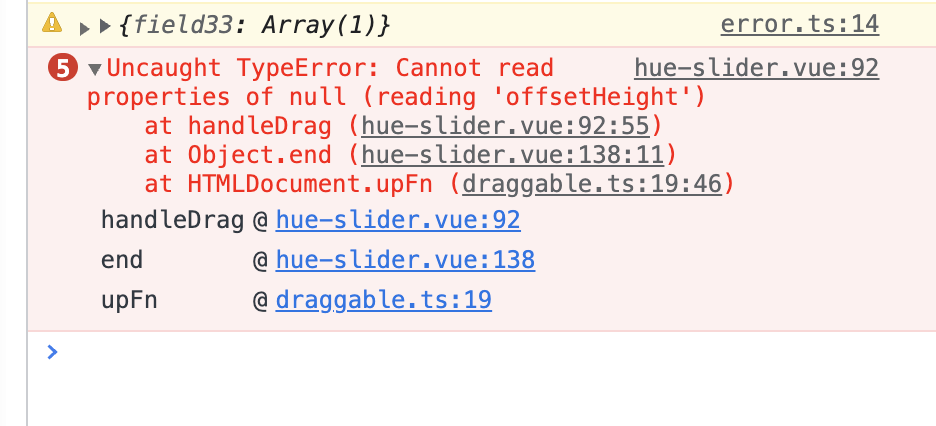

# CurdCreate 说明文档

## 安装

```shell
# 暂未发布npm，
```

## 表单组件 API

<!-- [文档](./form.md) -->

# BasicForm 表单 API

> 对 element-plus 的 form 组件进行封装，扩展一些常用的功能,如果文档内没有，可以尝试在在线示例内寻找

## 两种使用方式

### 1. useForm

> 通过 useForm 创建表单，并通过 useForm hooks 快速调用内部方法

```vue
<script lang="ts">
import { defineComponent } from 'vue'
import { ElMessage } from 'element-plus'
import { BasicForm, FormSchema, useForm } from '@/components/index'
import { areaRecord } from '@/api/demo/cascader'

const schemas: FormSchema[] = [
  {
    field: 'field1',
    component: 'Input',
    label: '字段1',
    colProps: {
      span: 8
    },
    componentProps: {
      placeholder: '自定义placeholder',
      onChange: (e: any) => {
        console.log(e)
      }
    }
  },
  {
    field: 'fieldTime',
    component: 'DatePicker',
    label: '时间字段',
    colProps: {
      span: 8
    },
    componentProps() {
      return {
        type: 'datetimerange',
        rangeSeparator: 'To',
        startPlaceholder: 'Start date',
        endPlaceholder: 'End date'
      }
    }
  }
]

export default defineComponent({
  components: { BasicForm },
  setup() {
    const [register, { setProps, setFieldsValue, updateSchema }] = useForm({
      labelWidth: 120,
      schemas,
      actionColOptions: {
        span: 24
      },
      fieldMapToTime: [['fieldTime', ['startTime', 'endTime'], 'YYYY-MM']]
    })

    async function handleLoad() {
      const promiseFn = function () {
        return new Promise((resolve) => {
          setTimeout(() => {
            resolve({
              field9: ['430000', '430100', '430102'],
              province: '湖南省',
              city: '长沙市',
              district: '岳麓区'
            })
          }, 1000)
        })
      }

      const item = await promiseFn()

      const { field9, province, city, district } = item as any
      await updateSchema({
        field: 'field9',
        componentProps: {
          displayRenderArray: [province, city, district]
        }
      })
      await setFieldsValue({
        field9
      })
    }

    return {
      register,
      schemas,
      handleSubmit: (values: Recordable) => {
        ElMessage.success(`click search,values:${JSON.stringify(values)}`)
      },
      setProps,
      handleLoad
    }
  }
})
</script>

<template>
  <el-card title="UseForm操作示例">
    <div class="mb-4">
      <el-button class="mr-2" @click="setProps({ labelWidth: 150 })">
        更改labelWidth
      </el-button>
      <el-button class="mr-2" @click="setProps({ labelWidth: 120 })">
        还原labelWidth
      </el-button>
    </div>
    <el-card title="useForm示例">
      <BasicForm @register="register" @submit="handleSubmit" />
    </el-card>
  </el-card>
</template>
```

### 2. template

```vue
<script lang="ts">
import { defineComponent, ref } from 'vue'
import { BasicForm, FormActionType, FormProps, FormSchema } from '@/components/index'

const schemas: FormSchema[] = [
]

export default defineComponent({
  components: { BasicForm },
  setup() {
    const formElRef = ref<Nullable<FormActionType>>(null)
    return {
      formElRef,
      schemas,
      setProps(props: FormProps) {
        const formEl = formElRef.value
        if (!formEl)
          return
        formEl.setProps(props)
      },
    }
  },
})
</script>

<template>
  <div class="m-4">
    <BasicForm
      ref="formElRef"
      :schemas="schemas"
      :label-width="100"
      :action-col-options="{ span: 24 }"
      @submit="handleSubmit"
    />
    <div />
  </div>
</template>
```

### 参数介绍

```ts
const [register, methods] = useForm(props)
```

**参数 props 内的值可以是 computed 或者 ref 类型**

**register**

register 用于注册 `useForm`，如果需要使用 `useForm` 提供的 api，必须将 register 传入组件的 `onRegister`

### BasicForm 内部方法

| 名称                | 说明                                                                                                            | 类型                                                                          |
| ------------------- | --------------------------------------------------------------------------------------------------------------- | ----------------------------------------------------------------------------- |
| submit              | 表单提交，返回表单的所有提交数据                                                                                | `() => Promise<Recordable>`                                                   |
| setFieldsValue      | 手动设置表单的值                                                                                                | `<T>(values: T) => Promise<void>`                                             |
| resetFields         | 重置表单                                                                                                        | `() => Promise<void>`                                                         |
| getFieldsValue      | 获取表单的值                                                                                                    | `() => Recordable`                                                            |
| clearValidate       | 清除所有的错误验证信息                                                                                          | `(name?: string \| string[]) => Promise<void>`                                |
| updateSchema        | 更新表单的一个&多个 schema，仅需设置要更新的值，内部会做合并,新的 field 会做添加                                | `(data: Partial<FormSchema> \| Partial<FormSchema>[]) => Promise<void>`       |
| resetSchema         | 重置 schema，该操作会替换原有的 schema                                                                          | `(data: Partial<FormSchema> \| Partial<FormSchema>[]) => Promise<void>`       |
| setProps            | 设置 Form 的 Props, 设置表单的 props 可以直接在标签上传递，也可以使用 setProps，或者初始化直接写 useForm(props) | `(formProps: Partial<FormProps>) => Promise<void>`                            |
| removeSchemaByFiled | 根据 field 删除 schema                                                                                          | `(field: string \| string[]) => Promise<void>`                                |
| appendSchemaByField | 插入到指定 filed 后面，如果没传指定 field，则插入到最后,当 first = true 时插入到第一个位置                      | `(schema: FormSchema, prefixField: string, first?: boolean) => Promise<void>` |
| validateField       | 验证一个或多个参数是否合规                                                                                      | `(props?: FormItemProp) => Promise<any>`                                      |
| validate            | 验证整个表单，并返回表单数据                                                                                    | `() => Promise<Recordable>`                                                   |
| scrollToField       | 滚动到指定的字段                                                                                                | `(prop: FormItemProp) => void`                                                |

使用示例

```ts
setProps({ labelWidth: 150 })

updateSchema([
  { field: 'filed', componentProps: { disabled: true } },
  { field: 'filed1', componentProps: { disabled: false } }
])
```

### BasicForm 属性

| 属性                  | 说明                                                                                       | 类型                              | 默认值                                                         |
| --------------------- | ------------------------------------------------------------------------------------------ | --------------------------------- | -------------------------------------------------------------- | --- |
| model                 | 表单数据对象                                                                               | `Recordable<string, any>`         | -                                                              |
| labelWidth            | 标签的长度，例如 '50px'。 作为 Form 直接子元素的 form-item 会继承该值。 可以使用 auto。    | `number \| string`                | -                                                              |
| labelPosition         | 表单域标签的位置， 当设置为 left 或 right 时，则也需要设置 label-width 属性                | `'left' \| 'right' \| 'top'`      | `'left'`                                                       |
| labelSuffix           | 表单域标签的后缀                                                                           | `string`                          | -                                                              |
| inline                | 行内表单模式                                                                               | `boolean`                         | `false`                                                        |
| showMessage           | 是否显示校验错误信息                                                                       | `boolean`                         | `true`                                                         |
| inlineMessage         | 是否以行内形式展示校验信息                                                                 | `boolean`                         | `false`                                                        |
| hideRequiredAsterisk  | 是否显示必填字段的标签旁边的红色星号                                                       | `boolean`                         | `false`                                                        |
| statusIcon            | 是否在输入框中显示校验结果反馈图标                                                         | `boolean`                         | `false`                                                        |
| scrollToError         | 当校验失败时，滚动到第一个错误表单项                                                       | `boolean`                         | `false`                                                        |
| rowProps              | row 配置参数                                                                               | `Partial<RowProps>`               | -                                                              |
| submitOnReset         | 点击重置表单时 触发一次查询                                                                | `boolean`                         | `false`                                                        |
| submitOnChange        | 表单变化时自动触发查询                                                                     | `boolean`                         | `false`                                                        |
| baseRowStyle          | 配置所有 Row 的 style 样式                                                                 | `CSSProperties`                   | -                                                              |
| baseColProps          | 配置所有选子项的 ColProps，不需要逐个配置，子项也可单独配置优先与全局                      | -                                 | `Partial<ColEx>`                                               | -   |
| schemas               | 表单配置，见下方 `FormSchema` 配置                                                         | `FormSchema[]`                    | `[]`                                                           |
| mergeDynamicData      | 额外传递到子组件的参数 values                                                              | `Recordable`                      | `{}`                                                           |
| compact               | 紧凑类型表单，减少 margin-bottom                                                           | `boolean`                         | `false`                                                        |
| emptySpan             | 空白行格,可以是数值或者 col 对象 数                                                        | `number \| Partial<ColEx>`        | `0`                                                            |
| size                  | 向表单内所有组件传递 size 参数,自定义组件需自行实现 size 接收                              | `'default' \| 'small' \| 'large'` | `default`                                                      |
| disabled              | 向表单内所有组件传递 disabled 属性，自定义组件需自行实现 disabled 接收                     | `boolean`                         | `false`                                                        |
| fieldMapToTime        | 用于将表单内时间区域的应设成 2 个字段, 见下方说明                                          | `FieldMapToTime`                  | -                                                              |
| autoSetPlaceHolder    | 自动设置表单内组件的 placeholder，自定义组件需自行实现                                     | `boolean`                         | `true`                                                         |
| autoSubmitOnEnter     | 在 input 中输入时按回车自动提交                                                            | `boolean`                         | `false`                                                        |
| rulesMessageJoinLabel | 如果表单项有校验，会自动生成校验信息，该参数控制是否将字段中文名字拼接到自动生成的信息后方 | `boolean`                         | `true`                                                         |
| showAdvancedButton    | 是否显示收起展开按钮                                                                       | `boolean`                         | `false`                                                        |
| autoFocusFirstItem    | 是否聚焦第一个输入框，只在第一个表单项为 input 的时候作用                                  | `boolean`                         | `false`                                                        |
| autoAdvancedLine      | 如果 showAdvancedButton 为 true，超过指定行数行默认折叠                                    | `number`                          | `3`                                                            |
| alwaysShowLines       | 折叠时始终保持显示的行数                                                                   | `number`                          | `1`                                                            |
| showActionButtonGroup | 是否显示操作按钮(重置/提交)                                                                | `boolean`                         | `true`                                                         |
| resetButtonOptions    | 重置按钮配置 见下方：ButtonOptions                                                         | `Partial<ButtonOptions>`          | -                                                              |
| submitButtonOptions   | 确认按钮配置                                                                               | `Partial<ButtonOptions>`          | -                                                              |
| actionColOptions      | 操作按钮外层 Col 组件配置，如果开启 showAdvancedButton，则不用设置，                       | `Partial<ColEx>`                  | -                                                              |
| showResetButton       | 显示重置按钮                                                                               | `boolean`                         | `true`                                                         |
| showSubmitButton      | 显示提交按钮                                                                               | `boolean`                         | `true`                                                         |
| resetFunc             | 重置回调函数                                                                               | `() => Promise<void>`             | -                                                              |
| submitFunc            | 自定义提交按钮逻辑                                                                         | `() => Promise<void>`             | -                                                              |
| transformDateFunc     | 时间格式转换函数                                                                           | `(date: any) => string`           | `(date: any) => date?.format?.('YYYY-MM-DD HH:mm:ss') ?? date` |
| tableAction           | table 的内部方法                                                                           | `Partial<TableActionType>`        | -                                                              |

**ColEx**

```ts
type ColSpanType = number | string
export interface ColEx {
  style?: any
  span?: ColSpanType
  order?: ColSpanType
  flex?: ColSpanType
  offset?: ColSpanType
  push?: ColSpanType
  pull?: ColSpanType
  xs?: { span: ColSpanType; offset: ColSpanType } | ColSpanType
  sm?: { span: ColSpanType; offset: ColSpanType } | ColSpanType
  md?: { span: ColSpanType; offset: ColSpanType } | ColSpanType
  lg?: { span: ColSpanType; offset: ColSpanType } | ColSpanType
  xl?: { span: ColSpanType; offset: ColSpanType } | ColSpanType
  xxl?: { span: ColSpanType; offset: ColSpanType } | ColSpanType
}
```

**fieldMapToTime**

> 将表单内时间区域的值映射成 2 个字段
> 如果表单内有时间区间组件，获取到的值是一个数组，但是往往我们传递到后台需要是 2 个字段

类型：

```ts
export type FieldMapToTime = [string, [string, string], string?][]
```

使用示例

```ts
useForm({
  fieldMapToTime: [
    // data为时间组件在表单内的字段，startTime，endTime为转化后的开始时间于结束时间
    // 'YYYY-MM-DD'为时间格式，参考moment
    ['datetime', ['startTime', 'endTime'], 'YYYY-MM-DD'],
    // 支持多个字段
    ['datetime1', ['startTime1', 'endTime1'], 'YYYY-MM-DD HH:mm:ss'],
  ],
});

// fieldMapToTime没写的时候表单获取到的值
{
  datetime: [Date(),Date()]
}
//  ['datetime', ['startTime', 'endTime'], 'YYYY-MM-DD'],之后
{
    datetime: [Date(),Date()],
    startTime: '2020-08-12',
    endTime: '2020-08-15',
}
```

**ButtonOptions**

```ts
import type { ButtonProps } from 'element-plus'

export type ButtonOptions = Partial<ButtonProps> & { innerTxt?: string }
```

### FormSchema

| 属性                   | 说明                                           | 类型                                                                                                                                           | 默认值  |
| ---------------------- | ---------------------------------------------- | ---------------------------------------------------------------------------------------------------------------------------------------------- | ------- |
| field                  | 字段名称, 必填字段,支持 x.x.x.x                | `string`                                                                                                                                       | -       |
| changeEvent            | 表单更新事件名称 默认 change                   | `string`                                                                                                                                       | -       |
| label                  | 标签名称, 必填字段                             | string                                                                                                                                         | -       |
| subLabel               | 二级标签                                       | string                                                                                                                                         | -       |
| helpMessage            | 签名右侧的提示信息                             | `string \| string[] \| (renderCallbackParams: RenderCallbackParams) => (string \| string[])`                                                   | -       |
| helpComponentProps     | 提示信息组件的 props                           | `Partial<HelpComponentProps>`                                                                                                                  | -       |
| labelWidth             | 标签宽度, 会覆盖统一设置的 labelWidth          | `string \| number`                                                                                                                             | -       |
| component              | 使用的组件, 必填字段                           | `ComponentType`                                                                                                                                | -       |
| componentProps         | 组件的配置参数                                 | `((opt: { schema: FormSchema, tableAction: TableActionType, formActionType: FormActionType, formModel: Recordable }) => Recordable) \| object` | -       |
| required               | 是否是必填                                     | `boolean \| ((renderCallbackParams: RenderCallbackParams) => boolean)`                                                                         | `false` |
| suffix                 | 组件后缀文案                                   | `string \| number \| ((values: RenderCallbackParams) => (string \| number))`                                                                   | -       |
| rules                  | 验证规则                                       | `Rule[]`                                                                                                                                       | -       |
| rulesMessageJoinLabel  | 校验信息是否加入 label                         | `boolean`                                                                                                                                      | `false` |
| colProps               | 参数的 col 配置, 会覆盖统一设置的 baseColProps | `Partial<ColEx>`                                                                                                                               | -       |
| defaultValue           | 默认值                                         | any                                                                                                                                            | -       |
| isAdvanced             | 展开收起                                       | `boolean`                                                                                                                                      | `false` |
| ifShow                 | 是否加载                                       | `boolean \| ((renderCallbackParams: RenderCallbackParams) => boolean)`                                                                         | -       |
| show                   | 加载后是否显示                                 | `boolean \| ((renderCallbackParams: RenderCallbackParams) => boolean)`                                                                         | -       |
| render                 | 自定义渲染 form-item 的标签内容                | `(renderCallbackParams: RenderCallbackParams) => VNode \| VNode[] \| string`                                                                   | -       |
| renderColContent       | 自定义渲染 col 的内容包括 form-item            | `(renderCallbackParams: RenderCallbackParams) => VNode \| VNode[] \| string`                                                                   | -       |
| renderComponentContent | 自定义渲染组内部的 slot                        | `((renderCallbackParams: RenderCallbackParams) => any) \| VNode \| VNode[] \| string`                                                          | -       |
| slot                   | formItem 内的自定义插槽                        | `string`                                                                                                                                       | -       |
| colSlot                | col 下的自定义插槽与 renderColContent 类似     | string                                                                                                                                         | -       |
| dynamicDisabled        | 动态禁用                                       | `boolean \| ((renderCallbackParams: RenderCallbackParams) => boolean)`                                                                         | -       |
| dynamicRules           | 动态规则验证                                   | `(renderCallbackParams: RenderCallbackParams) => Rule[]`                                                                                       | -       |

**RenderCallbackParams**

```ts
export interface RenderCallbackParams {
  schema: FormSchema
  values: Recordable
  model: Recordable
  field: string
}
```

**componentProps**

- 当值为对象类型时,该对象将作为`component`所对应组件的的 props 传入组件

- 当值为一个函数时候

参数有 4 个

`schema`: 表单的整个 schemas

`formActionType`: 操作表单的函数。与 useForm 返回的操作函数一致

`formModel`: 表单的双向绑定对象，这个值是响应式的。所以可以方便处理很多操作

`tableAction`: 操作表格的函数，与 useTable 返回的操作函数一致。注意该参数只在表格内开启搜索表单的时候有值，其余情况为`null`,

```tsx
{
  // 简单例子，值改变的时候操作表格或者修改表单内其他元素的值
  component:'Input',
  componentProps: ({ schema, tableAction, formActionType, formModel }) => {
    return {
      // xxxx props
      onChange:(e)=>{
        const {reload}=tableAction
        reload()
        // or
        formModel.xxx='123'
      }
    };
  };
}
```

**HelpComponentProps**

```ts
export interface HelpComponentProps {
  maxWidth: string
  // 是否显示序号
  showIndex: boolean
  // 文本列表
  text: any
  // 颜色
  color: string
  // 字体大小
  fontSize: string
  icon: string
  absolute: boolean
  // 定位
  position: any
}
```

**ComponentType**

schema 内组件的可选类型

```tsx
export type ComponentType =
  | 'Input'
  | 'ColorPicker'
  | 'Slider'
  | 'Rate'
  | 'Divider'
  | 'InputNumber'
  | 'Select'
  | 'Checkbox'
  | 'CheckboxGroup'
  | 'Cascader'
  | 'DatePicker'
  | 'TimeSelect'
  | 'TimePicker'
  | 'Switch'
  | 'Radio'
  | 'RadioGroup'
  | 'TreeSelect'
  | 'Tree'
  | 'Transfer'
  | 'AutoComplete'
```

### Divider schema 说明

`Divider`类型用于在`schemas`中占位，将会渲染成一个分割线（始终占一整行的版面），可以用于较长表单的版面分隔。请只将 Divider 类型的 schema 当作一个分割线，而不是一个常规的表单字段。

- **`Divider`仅在`showAdvancedButton`为 false 时才会显示**（也就是说如果启用了表单收起和展开功能，`Divider`将不会显示）
- `Divider` 使用`schema`中的`label`以及`helpMessage`来渲染分割线中的提示内容
- `Divider` 可以使用`componentProps`来设置除`type`之外的 props
- `Divider` 不会渲染`AFormItem`，因此`schema`中除`label`、`componentProps`、`helpMessage`、`helpComponentProps`以外的属性不会被用到

### 自定义内容渲染 （render & renderComponentContent & slot）

```vue
<script lang="ts">
import { defineComponent, h } from 'vue'
import { ElInput, ElMessage } from 'element-plus'
import { BasicForm, FormSchema, useForm } from '@/components/index'

const schemas: FormSchema[] = [
  {
    field: 'field1',
    component: 'Input',
    label: 'render方式',
    colProps: {
      span: 8
    },
    rules: [{ required: true }],
    render: ({ model, field }) => {
      return h(ElInput, {
        placeholder: '请输入',
        modelValue: model[field],
        onInput: (value: any) => {
          model[field] = value
        }
      })
    }
  },
  {
    field: 'field2',
    component: 'Input',
    label: 'render组件slot',
    colProps: {
      span: 8
    },
    rules: [{ required: true }],
    renderComponentContent: () => {
      return {
        suffix: () => 'suffix'
      }
    }
  },
  {
    field: 'field3',
    component: 'Input',
    label: '自定义Slot',
    slot: 'f3',
    colProps: {
      span: 8
    },
    rules: [{ required: true }]
  }
]
export default defineComponent({
  components: { BasicForm },
  setup() {
    const [register, { setProps }] = useForm({
      labelWidth: 120,
      schemas,
      actionColOptions: {
        span: 24
      }
    })
    return {
      register,
      schemas,
      handleSubmit: (values: any) => {
        ElMessage.success(`click search,values:${JSON.stringify(values)}`)
      },
      setProps
    }
  }
})
</script>

<template>
  <el-card title="自定义表单">
    <BasicForm @register="register" @submit="handleSubmit">
      <template #f3="{ model, field }">
        <el-input v-model="model[field]" placeholder="自定义slot" />
      </template>
    </BasicForm>
  </el-card>
</template>
```

### ifShow/show/dynamicDisabled

自定义显示/禁用

```vue
<script lang="ts">
import { defineComponent } from 'vue'
import { BasicForm, FormSchema, useForm } from '@/components/index'

const schemas: FormSchema[] = [
  {
    field: 'field1',
    component: 'Input',
    label: '字段1',
    colProps: {
      span: 8
    },
    show: ({ values }) => {
      return !!values.field5
    }
  },
  {
    field: 'field2',
    component: 'Input',
    label: '字段2',
    colProps: {
      span: 8
    },
    ifShow: ({ values }) => {
      return !!values.field6
    }
  },
  {
    field: 'field3',
    component: 'DatePicker',
    label: '字段3',
    colProps: {
      span: 8
    },
    dynamicDisabled: ({ values }) => {
      return !!values.field7
    }
  }
]

export default defineComponent({
  components: { BasicForm },
  setup() {
    const [register, { setProps }] = useForm({
      labelWidth: 120,
      schemas,
      actionColOptions: {
        span: 24
      }
    })
    return {
      register,
      schemas,
      setProps
    }
  }
})
</script>

<template>
  <div class="m-4">
    <BasicForm @register="register" />
  </div>
</template>
```

### BasicForm 插槽

| 名称          | 说明         |
| ------------- | ------------ |
| formFooter    | 表单底部区域 |
| formHeader    | 表单顶部区域 |
| resetBefore   | 重置按钮前   |
| submitBefore  | 提交按钮前   |
| advanceBefore | 展开按钮前   |
| advanceAfter  | 展开按钮后   |

## ApiSelect

> 远程下拉加载组件

### 使用示例

```html
<template>
  <ApiSelect
    :api="api"
    :modelValue="value"
    :collapseTags="true"
    :collapseTagsTooltip="true"
    :multiple="true"
    :params="{name: 1}"
    :afterFetch="(params) => params"
    :beforeFetch="(params) => params"
    @change="(params) => (model[field] = params)"
  />
</template>
<script lang="ts" setup>
  import ApiSelect from '@/components/Form/components/ApiSelect.vue'
  const value = ref<Recordable[]>([])
  const api = (params) =>
    new Promise((resolve, reject) => {
      setTimeout(() => {
        resolve([
          {
            value: '1',
            label: '1'
          }
        ])
      }, 1000)
    })
</script>
```

### props

| 属性           | 类型                                          | 默认值    | 说明                                                        |
| :------------- | :-------------------------------------------- | :-------- | :---------------------------------------------------------- |
| api            | `(args?: Recordable) => Promise<OptionsItem>` | -         | 数据接口，接受一个 Promise 对象                             |
| numberToString | `boolean`                                     | `false`   | 是否将 value 数字转换为字符串                               |
| params         | `object`                                      | -         | 接口参数。此属性改变时会自动重新加载接口数据                |
| modelValue     | `any`                                         | -         | 双向绑定的 key                                              |
| resultField    | `string`                                      | -         | 接口返回的字段，如果接口返回数组，可以不填。支持 x.x.x 格式 |
| labelField     | `string`                                      | `label`   | 下拉数组项内 label 显示文本的字段，支持 x.x.x 格式          |
| valueField     | `string`                                      | `value`   | 下拉数组项内 value 实际值的字段，支持 x.x.x 格式            |
| groupField     | `string`                                      | `options` | 选项组，支持 x.x.x 格式                                     |
| immediate      | `boolean`                                     | `false`   | 是否立即请求                                                |
| alwaysLoad     | `boolean`                                     | `false`   | 是否每一次打开 popover 都重新请求                           |
| isGroup        | `boolean`                                     | `false`   | 是不是分组选项                                              |
| options        | `Recordable[]`                                | `[]`      | 下拉框的静态选项数据                                        |
| afterFetch     | `(params: Recordable) => Recordable`          | -         | 请求之后返回参数处理                                        |
| beforeFetch    | `(params: Recordable) => Recordable`          | -         | 请求前参数处理                                              |

### 事件

| 事件名称       | 说明                 | 回调参数             |
| -------------- | -------------------- | -------------------- |
| options-change | options 变化后的回调 | `() => Recordable[]` |
| change         | value 变化后的回调   | `() => any`          |

## CheckboxGroup

> 自定义多选组

### 使用示例

```vue
<script lang="ts" setup>
import CheckboxGroup from '@/components/Form/components/CheckboxGroup.vue'

const value = ref([])
</script>

<template>
  <CheckboxGroup
    model-value="value" :is-btn="true" :options="[ { label: "选项1', value: '1', key: '1' }, { label:
    '选项2', value: '2', key: '2' } ]'
  />
</template>
```

### Props

| 属性       | 类型           | 默认值  | 说明                              |
| :--------- | :------------- | :------ | :-------------------------------- |
| modelValue | `any`          | -       | 双向绑定的 key                    |
| options    | `Recordable[]` | `[]`    | Checkbox 列表                     |
| isBtn      | `boolean`      | `false` | 是否是 button 类型的多选 CheckBox |

## RadioGroup

> 自定义单选组

### 使用示例

```vue
<script lang="ts" setup>
import RadioGroup from '@/components/Form/components/RadioGroup.vue'

const value = ref([])
</script>

<template>
  <RadioGroup
    model-value="value" :is-btn="true" :options="[ { label: "选项1', value: '1', key: '1' }, { label: '选项2',
    value: '2', key: '2' } ]'
  />
</template>
```

### Props

| 属性       | 类型           | 默认值  | 说明                         |
| :--------- | :------------- | :------ | :--------------------------- |
| modelValue | `any`          | -       | 双向绑定的 key               |
| options    | `Recordable[]` | `[]`    | 单选列表                     |
| isBtn      | `boolean`      | `false` | 是否是 button 类型的多选单选 |

## 表格组件 API

<!-- [文档](./table.md) -->

# BasicTable 表格

> 对 element-plus 的 table 组件进行封装，扩展一些常用的功能, 同时融合了 BasicForm 如果文档内没有，可以尝试在在线示例内寻找

## 使用示例

### template 示例

**基础使用**

```vue
<script lang="ts">
import { defineComponent, ref } from 'vue'
import { getBasicColumns, getBasicData } from './tableData'
import { BasicTable } from '@/components/index'

export default defineComponent({
  components: { BasicTable },
  setup() {
    return {
      columns: getBasicColumns(),
      data: getBasicData()
    }
  }
})
</script>

<template>
  <div class="p-4">
    <BasicTable
      title="基础示例"
      title-help-message="温馨提醒"
      :columns="columns"
      :data="data"
      :can-resize="canResize"
      :loading="loading"
      :stripe="striped"
      :border="border"
      :pagination="{ pageSize: 20 }"
    >
      <template #toolbar>
        <a-button type="primary">
          操作按钮
        </a-button>
      </template>
    </BasicTable>
  </div>
</template>
```

**使用 API 调用接口**

`Methods`使用，所有 methods 见下方：

```vue
<script lang="ts">
import { defineComponent, ref, unref } from 'vue'
import { getBasicColumns, getBasicShortColumns } from './tableData'
import { BasicTable, TableActionType } from '@/components/index'
import { demoListApi } from '@/api/demo/table'

export default defineComponent({
  components: { BasicTable },
  setup() {
    const tableRef = ref<Nullable<TableActionType>>(null)

    function getTableAction() {
      const tableAction = unref(tableRef)
      if (!tableAction)
        throw new Error('tableAction is null')

      return tableAction
    }
    function changeLoading() {
      getTableAction().setLoading(true)
      setTimeout(() => {
        getTableAction().setLoading(false)
      }, 1000)
    }
    return {
      tableRef,
      api: demoListApi,
      columns: getBasicColumns(),
      beforeFetch: (params: Recordable) => params,
      afterFetch: (params: Recordable) => params,
      changeLoading
    }
  }
})
</script>

<template>
  <div class="p-4">
    <BasicTable
      ref="tableRef"
      :can-resize="false"
      title="RefTable示例"
      title-help-message="使用Ref调用表格内方法"
      :api="api"
      :columns="columns"
      :before-fetch="beforeFetch"
      :after-fetch="afterFetch"
      row-key="id"
    />
  </div>
</template>
```

### BasicColumn 和 tableAction 通过权限和业务控制显示隐藏的示例

```vue
<script lang="ts">
import { defineComponent, h, ref } from 'vue'
import { Edit } from '@element-plus/icons-vue'
import { getBasicColumns, getBasicData } from './tableData'
import { BasicTable, ColumnChangeParam, TableAction } from '@/components/index'

export default defineComponent({
  components: { BasicTable, TableAction, Edit },
  setup() {
    const canResize = ref(false)
    const loading = ref(false)
    const striped = ref(true)
    const border = ref(true)
    const pagination = ref<any>(false)
    function toggleCanResize() {
      canResize.value = !canResize.value
    }
    function toggleStriped() {
      striped.value = !striped.value
    }
    function toggleLoading() {
      loading.value = true
      setTimeout(() => {
        loading.value = false
        pagination.value = { pageSize: 20 }
      }, 3000)
    }
    function toggleBorder() {
      border.value = !border.value
    }

    function handleColumnChange(data: ColumnChangeParam[]) {
      console.log('ColumnChanged', data)
    }

    const togglePagination = () => {
      pagination.value = !pagination.value
    }

    const inconFun = () => {
      return h(Edit)
    }

    const configTest = () => {
      console.log('ConfigTest', getBasicColumns())
    }
    return {
      columns: getBasicColumns(),
      data: getBasicData(),
      configTest,
      canResize,
      loading,
      striped,
      border,
      toggleStriped,
      toggleCanResize,
      toggleLoading,
      toggleBorder,
      pagination,
      handleColumnChange,
      togglePagination,
      inconFun
    }
  }
})
</script>

<template>
  <div class="p-4">
    <BasicTable
      title="基础示例"
      title-help-message="温馨提醒"
      :columns="columns"
      :data="data"
      :can-resize="canResize"
      :loading="loading"
      :stripe="striped"
      :border="border"
      show-table-setting
      :pagination="pagination"
      @columns-change="handleColumnChange"
    >
      <template #toolbar>
        <el-button size="small" type="primary" @click="toggleCanResize">
          {{ !canResize ? '自适应高度' : '取消自适应' }}
        </el-button>
        <el-button size="small" type="primary" @click="toggleBorder">
          {{ !border ? '显示边框' : '隐藏边框' }}
        </el-button>
        <el-button size="small" type="primary" @click="toggleLoading">
          开启loading
        </el-button>
        <el-button size="small" type="primary" @click="toggleStriped">
          {{ !striped ? '显示斑马纹' : '隐藏斑马纹' }}
        </el-button>
        <el-button size="small" type="primary" @click="togglePagination">
          {{ pagination ? '关闭分页' : '开启分页' }}
        </el-button>
      </template>
      <template #action="scope">
        <TableAction
          :actions="[
            {
              label: '编辑',
              onClick: () => {},
              icon: inconFun,
              popConfirm: {
                title: '是否启用？',
                confirm: configTest,
              },
            },
            {
              label: '删除',
              color: 'error',
              popConfirm: {
                title: '是否确认删除',
                placement: 'left',
                confirm: () => {},
              },
            },
          ]"
          :drop-down-actions="[
            {
              label: '启用',
              popConfirm: {
                title: '是否启用？',
                confirm: () => {},
              },
              ifShow: () => {
                return scope.row.status !== 'enable'
              },
            },
            {
              label: '禁用',
              popConfirm: {
                title: '是否禁用？',
                confirm: () => {},
              },
              ifShow: () => {
                return scope.row.status === 'enable'
              },
            },
            {
              label: '同时控制',
              popConfirm: {
                title: '是否动态显示？',
                confirm: () => {},
              },
              ifShow: () => {
                return true
              },
            },
          ]"
        />
      </template>
    </BasicTable>
  </div>
</template>
```

## useTable

使用组件自带的 **useTable** 可以方便使用表单

下面是一个使用简单表格的示例，

```vue
<script lang="ts">
import { defineComponent } from 'vue'
import { getBasicColumns, getBasicShortColumns } from './tableData'
import { BasicTable, useTable } from '@/components/index'
import { demoListApi } from '@/api/demo/table'

export default defineComponent({
  components: { BasicTable },
  setup() {
    const [registerTable, { setLoading }] = useTable({
      api: demoListApi,
      columns: getBasicColumns()
    })

    function changeLoading() {
      setLoading(true)
      setTimeout(() => {
        setLoading(false)
      }, 1000)
    }

    return {
      registerTable,
      changeLoading
    }
  }
})
</script>

<template>
  <BasicTable @register="registerTable" />
</template>
```

### Usage

用于调用 Table 内部方法及 table 参数配置

```ts
// 表格的props也可以直接注册到useTable内部
const [register, methods] = useTable(props)
```

**register**

register 用于注册 useTable，如果需要使用`useTable`提供的 api，必须将 register 传入组件的 onRegister

```vue
<script>
export default defineComponent({
  components: { BasicForm },
  setup() {
    const [register] = useTable()
    return { register }
  }
})
</script>

<template>
  <BasicTable @register="register" />
</template>
```

## BasicTable 方法

| 方法名称              | 说明                                                                                                                 | 类型                                                                   |
| --------------------- | -------------------------------------------------------------------------------------------------------------------- | ---------------------------------------------------------------------- |
| reload                | 刷新列表, `FetchParams`见下方                                                                                        | `(opt?: FetchParams) => Promise<void>`                                 |
| setPagination         | 设置分页信息                                                                                                         | `(info: Partial<PaginationProps>) => void`                             |
| setTableData          | 设置表格源数据                                                                                                       | `<T = Recordable>(values: T[]) => void`                                |
| updateTableDataRecord | 根据 rowkey 找到该条数据，并替换内部某个参数                                                                         | `(rowKey: string \| number, record: Recordable) => Recordable \| void` |
| deleteTableDataRecord | 删除表格源数据                                                                                                       | `(rowKey: string \| number \| string[] \| number[]) => void`           |
| updateTableData       | 更新表格源数据，完整替换                                                                                             | `(index: number, key: string, value: any) => Recordable`               |
| insertTableDataRecord | 插入数据，如果有 index，则在指定索引后添加，如果没有则添加到数据的尾端                                               | `(record: Recordable, index?: number) => Recordable[]`                 |
| findTableDataRecord   | 根据 rowkey 查找源数据中的某一条                                                                                     | `(rowKey: string \| number) => Recordable \| undefined`                |
| getDataSource         | 获取表格数据列表                                                                                                     | `<T = Recordable>() => T[]`                                            |
| getRawDataSource      | 获取接口获取的源数据列表                                                                                             | `<T = Recordable>() => T`                                              |
| getColumns            | 获取表格列配置数据,仅 tableProps 的 columns                                                                          | `(opt?: GetColumnsParams) => BasicColumn[]`                            |
| setColumns            | 设置表格列配置，如果是数组对象，则会替换 columns，如果是 prop[\],则 column 内 prop 不存在 prop[]内的 column 自动隐藏 | `(columns: BasicColumn[] \| string[]) => void`                         |
| setLoading            | 设置表格 loading                                                                                                     | `(loading: boolean) => void`                                           |
| setProps              | 动态设置表格属性                                                                                                     | `(props: Partial<BasicTableProps>) => void`                            |
| redoHeight            | 重计算表格高度，如果设置了 height 或者 canResize=false，则无效                                                       | `() => void`                                                           |
| getPaginationRef      | 获取分页信息                                                                                                         | `() => Partial<PaginationProps>`                                       |
| getSize               | 获取表格大小                                                                                                         | `() => SizeType`                                                       |
| emit                  | BasicTable 内部事件                                                                                                  | `EmitType`                                                             |
| setShowPagination     | 设置显示隐藏分页器                                                                                                   | `(show: boolean) => Promise<void>`                                     |
| getShowPagination     | 获取分页器的显示状态                                                                                                 | `() => boolean`                                                        |
| clearSelection        | 用于多选表格，清空用户的选择                                                                                         | `() => void`                                                           |
| getSelectionRows      | 返回当前选中的行                                                                                                     | `() => Recordable[]`                                                   |
| toggleRowSelection    | 用于多选表格，切换某一行的选中状态， 如果使用了第二个参数，则可直接设置这一行选中与否                                | `(row: Recordable, selected: boolean) => void`                         |
| toggleAllSelection    | 用于多选表格，切换全选和全不选                                                                                       | `() => void`                                                           |
| toggleRowExpansion    | 用于可扩展的表格或树表格，如果某行被扩展，则切换。 使用第二个参数，您可以直接设置该行应该被扩展或折叠。              | `(row: Recordable, expanded: boolean) => void`                         |
| setCurrentRow         | 用于单选表格，设定某一行为选中行， 如果调用时不加参数，则会取消目前高亮行的选中状态。                                | `(row: Recordable) => void`                                            |
| clearSort             | 用于清空排序条件，数据会恢复成未排序的状态                                                                           | `() => void`                                                           |
| clearFilter           | 传入由 columnKey 组成的数组以清除指定列的过滤条件。 如果没有参数，清除所有过滤器                                     | `(columnKeys: string[]) => void`                                       |
| doLayout              | 对 Table 进行重新布局。 当表格可见性变化时，您可能需要调用此方法以获得正确的布局                                     | `() => void`                                                           |
| sort                  | 手动排序表格。 参数 prop 属性指定排序列，order 指定排序顺序。                                                        | `(prop: string, order: string) => void`                                |
| scrollTo              | 滚动到一组特定坐标                                                                                                   | `(options: ScrollToOptions \| number, yCoord?: number) => void`        |
| setScrollTop          | 设置垂直滚动位置                                                                                                     | `(top: number) => void`                                                |
| setScrollLeft         | 设置水平滚动位置                                                                                                     | `(left: number) => void`                                               |
| handleClearSort       | 清除所有的 sort 信息并重新请求                                                                                       | `() => void`                                                           |
| handleClearFilters    | 清除所有的过滤信息                                                                                                   | `(columnKeys?: string[]) => void`                                      |
| expandAll             | 展开所有                                                                                                             | `() => void`                                                           |
| collapseAll           | 收起所有                                                                                                             | `() => void`                                                           |
| getSelectRowKeys      | 获取所有选中行的 row-key                                                                                             | `() => (string \| number)[]`                                           |
| setSelectedRowKeys    | 根据 rowkey 设置选中                                                                                                 | `(keys: (string \| number)[]) => void`                                 |

## BasicTable 属性

> 部分属性如若没有请参考 element-plus 文档， 以下为 TableProps 扩展参数

| 属性                  | 说明                                                                                                                                                                           | 类型                                                                                               | 默认值                                                                                  |
| --------------------- | ------------------------------------------------------------------------------------------------------------------------------------------------------------------------------ | -------------------------------------------------------------------------------------------------- | --------------------------------------------------------------------------------------- | --- |
| data                  | 列表数据                                                                                                                                                                       | `Array as PropType<Recordable[]>`                                                                  | []                                                                                      | ,   |
| height                | Table 的高度， 默认为自动高度。 如果 height 为 number 类型，单位 px；如果 height 为 string 类型，则这个高度会设置为 Table 的 style.height 的值，Table 的高度会受控于外部样式。 | `string \| number`                                                                                 | `'auto'`                                                                                | ,   |
| maxHeight             | Table 的最大高度。 合法的值为数字或者单位为 px 的高度。自动计算的高度仍不会超过该高度                                                                                          | `string \| number`                                                                                 | -                                                                                       | ,   |
| stripe                | 是否为斑马纹 table                                                                                                                                                             | `Boolean`                                                                                          | `false`                                                                                 |
| border                | 是否带有纵向边框                                                                                                                                                               | `Boolean`                                                                                          | `false`                                                                                 |
| size                  | Table 的尺寸                                                                                                                                                                   | `SizeType`                                                                                         | `default`                                                                               |
| fit                   | 列的宽度是否自撑开                                                                                                                                                             | `Boolean`                                                                                          | `true`                                                                                  |
| showHeader            | 是否显示表头                                                                                                                                                                   | `Boolean`                                                                                          | `true`                                                                                  |
| highlightCurrentRow   | 是否要高亮当前行                                                                                                                                                               | `Boolean`                                                                                          | `false`                                                                                 |
| selectOnIndeterminate | 在多选表格中，当仅有部分行被选中时，点击表头的多选框时的行为。 若为 true，则选中所有行；若为 false，则取消选择所有行                                                           | `Boolean`                                                                                          | `true`                                                                                  |
| indent                | 展示树形数据时，树节点的缩进                                                                                                                                                   | `Number`                                                                                           | `16`                                                                                    |
| treeProps             | 渲染嵌套数据的配置选项                                                                                                                                                         | `Object`                                                                                           | `{ hasChildren: 'hasChildren', children: 'children' }`                                  |
| tableLayout           | 设置表格单元、行和列的布局方式                                                                                                                                                 | `'fixed' \| 'auto'`                                                                                | `'fixed'`                                                                               |
| sortFetchImmediate    | 排序变化立即请求                                                                                                                                                               | `Boolean`                                                                                          | `true`                                                                                  |
| sortFn                | 排序参数处理方法                                                                                                                                                               | `(sortInfo: SorterResult) => any`                                                                  | `DEFAULT_SORT_FN`                                                                       |
| filterFetchImmediate  | 过滤条件变化后立即请求                                                                                                                                                         | `Boolean`                                                                                          | `true`                                                                                  |
| filterFn              | 过滤参数处理方法                                                                                                                                                               | `(data: Recordable) => any`                                                                        | `(data: Recordable) => data`                                                            |
| isTreeTable           | 是否是树形表格                                                                                                                                                                 | `Boolean`                                                                                          | `false`                                                                                 |
| tableSetting          | 表格设置                                                                                                                                                                       | `TableSetting`                                                                                     | -                                                                                       |
| showTableSetting      | 是否显示表格设置                                                                                                                                                               | `Boolean`                                                                                          | `true`                                                                                  |
| inset                 | 是否取消表格内的 padding                                                                                                                                                       | `Boolean`                                                                                          | `true`                                                                                  |
| autoCreateKey         | 是否自动生成 key，针对 v-for 遍历                                                                                                                                              | `Boolean`                                                                                          | `true`                                                                                  |
| api                   | 请求接口，亦可使用 element-plus table 的 load 方法，区别在于数据处理完全放在外部处理                                                                                           | `(...arg: any) => Promise<any>`                                                                    | -                                                                                       |
| beforeFetch           | 请求前参数处理                                                                                                                                                                 | `(data: Recordable) => Recordable`                                                                 | -                                                                                       |
| afterFetch            | 请求结束后返回数据处理                                                                                                                                                         | `(data: Recordable) => Recordable`                                                                 | -                                                                                       |
| handleSearchInfoFn    | 开启表单后，在请求之前处理搜索条件参数                                                                                                                                         | `(data: Recordable) => Recordable`                                                                 | -                                                                                       |
| fetchSetting          | 接口请求配置，可以配置请求的字段和响应的字段名，                                                                                                                               | `FetchSetting`                                                                                     | `{ pageField: 'page', sizeField: 'pageSize', listField: 'items', totalField: 'total' }` |
| immediate             | 组件加载后是否立即请求接口，在 api 有传的情况下，如果为 false，需要自行使用 reload 加                                                                                          | `Boolean`                                                                                          | `true`                                                                                  |
| emptyDataIsShowTable  | 数据为空的时候是否显示 table                                                                                                                                                   | `Boolean`                                                                                          | `true`                                                                                  |
| searchInfo            | 额外的请求参数                                                                                                                                                                 | `Recordable`                                                                                       | -                                                                                       |
| title                 | 表格的标题                                                                                                                                                                     | `srting`                                                                                           | -                                                                                       |
| titleHelpMessage      | 标题的解释说明                                                                                                                                                                 | `string \| string[]`                                                                               | -                                                                                       |
| useSearchForm         | 使用搜索表单                                                                                                                                                                   | `Boolean`                                                                                          | `false`                                                                                 |
| formConfig            | 表单配置，参考表单组件的                                                                                                                                                       | `FormProps`                                                                                        | -                                                                                       |
| columns               | 表单列信息 BasicColumn[]                                                                                                                                                       | `BasicColumn[]`                                                                                    | `[]`                                                                                    |
| showIndexColumn       | 是否显示序号列                                                                                                                                                                 | `Boolean`                                                                                          | `true`                                                                                  |
| indexColumnProps      | 序号列配置 BasicColumn                                                                                                                                                         | `BasicColumn`                                                                                      | `{ width: 60,label: '#',align: 'center',fixed: 'left' }`                                |
| showSelectionColumn   | 显示多选框列                                                                                                                                                                   | `Boolean`                                                                                          | `false`                                                                                 |
| selectionColumnProps  | 多选列配置                                                                                                                                                                     | `BasicColumn`                                                                                      | `{width: 60, align: 'center', fixed: 'left',}`                                          |
| showExpandColumn      | 显示展开收起                                                                                                                                                                   | `Boolean`                                                                                          | `false`                                                                                 |
| expandColumnProps     | 展开收起列配置                                                                                                                                                                 | `BasicColumn`                                                                                      | `{width: 40, align: 'center', fixed: 'left', label: ''}`                                |
| actionColumn          | 表格右侧操作列配置 BasicColumn                                                                                                                                                 | `BasicColumn`                                                                                      | -                                                                                       |
| ellipsis              | 文本过长是否显示 ellipsis                                                                                                                                                      | `Boolean`                                                                                          | `true`                                                                                  |
| canResize             | 是否自动计算高度，铺满整屏                                                                                                                                                     | `Boolean`                                                                                          | `true`                                                                                  |
| isCanResizeParent     | 是否继承父级高度                                                                                                                                                               | `Boolean`                                                                                          | `false`                                                                                 |
| pagination            | 分页信息配置，为 `false` 不显示分                                                                                                                                              | `Partial<PaginationProps> \| boolean`                                                              | `false`                                                                                 |
| loading               | 表格 loading 状态                                                                                                                                                              | `Boolean`                                                                                          | `false`                                                                                 |
| beforeEditSubmit      | 单元格编辑状态提交回调，返回 false 将阻止单元格提交数据到 table。该回调在行编辑模式下无效。                                                                                    | `(data: { record: Recordable; index: number; key: string \| number; value: any }) => Promise<any>` | -                                                                                       |

**DEFAULT_SORT_FN**

```ts
(sortInfo: SorterResult) => {
  const { prop, order } = sortInfo
  if (prop && order) {
    return {
      // The sort prop passed to the backend you
      prop,
      // Sorting method passed to the background asc/desc
      order
    }
  }
  else {
    return {}
  }
}
```

**SizeType**

```ts
export type SizeType = 'default' | 'small' | 'large'
```

**TableSetting**

```ts
export interface TableSetting {
  redo?: boolean
  size?: boolean
  setting?: boolean
  fullScreen?: boolean
}
```

**FetchSetting**

```ts
export interface FetchSetting {
  // 请求接口当前页数
  pageField: string
  // 每页显示多少条
  sizeField: string
  // 请求结果列表字段  支持 a.b.c
  listField: string
  // 请求结果总数字段  支持 a.b.c
  totalField: string
}
```

## TableColumn 属性

**BasicColumn**

> 除了 element-plus table-column 配置[ TableColumnCtx ]外，以下为扩展参数

| 属性                | 说明                                                             | 类型                                                                                                                                               | 默认值  |
| ------------------- | ---------------------------------------------------------------- | -------------------------------------------------------------------------------------------------------------------------------------------------- | ------- |
| children            | 多级表头子集与 columns 属性作用一致，如果有数据则认为是多级表头  | `BasicColumn[]`                                                                                                                                    | -       |
| columns             | 多级表头子集与 children 属性作用一致，如果有数据则认为是多级表头 | `BasicColumn[]`                                                                                                                                    | -       |
| customLabel         | tableColumn 的自定义 label                                       | `VNode \| string`                                                                                                                                  | -       |
| flag                | tableColumn 的类型标记                                           | `'DEFAULT' \| 'ACTION'`                                                                                                                            | -       |
| slots               | 自定义插槽                                                       | `Recordable<{cellSlot?: string; headerSlot?: string}>`                                                                                             | -       |
| defaultHidden       | 是否默认隐藏                                                     | `boolean`                                                                                                                                          | `false` |
| helpMessage         | 该列的解释信息                                                   | `string \| string[]`                                                                                                                               | -       |
| helpComponentProps  | 提示信息组件的 props                                             | `Partial<HelpComponentProps>`                                                                                                                      | -       |
| format              | 单元格内的数据格式化，主要是针对时间戳                           | `CellFormat`                                                                                                                                       | -       |
| edit                | 是否开启单元格编辑                                               | `boolean`                                                                                                                                          | `false` |
| editRow             | 是否开启整行编辑                                                 | `boolean`                                                                                                                                          | `false` |
| editable            | 是否处于编辑状态                                                 | `boolean`                                                                                                                                          | `false` |
| editComponent       | 行内编辑组件的类型                                               | `ComponentType`                                                                                                                                    | `Input` |
| editComponentProps  | 对应编辑组件的 props                                             | `((opt: {text: string \| number \| boolean \| Recordable; record: Recordable; column: BasicColumn; index: number; }) => Recordable) \| Recordable` | -       |
| editRule            | 对应编辑组件的表单校验                                           | `((text: string, record: Recordable) => Promise<string>)`                                                                                          | -       |
| editValueMap        | 对应单元格值枚举                                                 | `(value: any) => string`                                                                                                                           | -       |
| onEditRow           | 触发行编辑                                                       | `（）=>void`                                                                                                                                       | -       |
| ifShow              | 业务控制是否显示                                                 | `boolean \| ((column: BasicColumn) => boolean)`                                                                                                    | -       |
| editRender          | 自定义修改后显示的内容                                           | `((opt: {text: string \| number \| boolean \| Recordable; record: Recordable; column: BasicColumn; index: number; }) => VNodeChild \| JSX.Element` | -       |
| editDynamicDisabled | 动态 Disabled                                                    | `boolean \| ((record: Recordable) => boolean)`                                                                                                     | -       |

**ComponentType**

```ts
export type ComponentType =
  | 'Input'
  | 'InputNumber'
  | 'Select'
  | 'ApiSelect'
  | 'Checkbox'
  | 'Switch'
  | 'DatePicker'
  | 'TimePicker'
```

**HelpComponentProps**

```ts
export interface HelpComponentProps {
  maxWidth: string
  // Whether to display the serial number
  showIndex: boolean
  // Text list
  text: any
  // colour
  color: string
  // font size
  fontSize: string
  icon: string
  absolute: boolean
  // Positioning
  position: any
}
```

**CellFormat**

```ts
export type CellFormat =
  | string
  | ((text: string, record: Recordable, index: number) => string | number)
  | Map<string | number, any>
```

## BasicTable 事件

> 除以下事件外，官方文档内的 event 也都支持，具体可以参考 element-plus table 事件

| 事件           | 回调参数                                          | 说明                                  |
| -------------- | ------------------------------------------------- | ------------------------------------- |
| fetch-success  | `Function({items,total})`                         | 接口请求成功后触发                    |
| fetch-error    | `Function(error)`                                 | 错误信息                              |
| register       | `Function(tableAction, formActions)`              | 表单注册事件                          |
| columns-change | `Function(record[])`                              | 列表 columns 变化时触发               |
| change         | `Function(PaginationProps, filterInfo, sortInfo)` | 分页、排序、过滤条件变化时触发        |
| sort-change    | `Function(sortInfo)`                              | 排序参数变化时触发                    |
| filter-change  | `Function(filterInfo)`                            | 过滤条件变化时触发                    |
| edit-end       | `Function({record, index, key, value})`           | 单元格编辑完成触发                    |
| edit-cancel    | `Function({record, index, key, value})`           | 单元格取消编辑触发                    |
| edit-row-end   | `Function()`                                      | 行编辑结束触发                        |
| edit-change    | `Function({column,value,record})`                 | 单元格编辑组件的 value 发生变化时触发 |

::: tip edit-change 说明

:::

```javascript
function onEditChange({ column, record }) {
  // 当同一行的单价或者数量发生变化时，更新合计金额（三个数据均为当前行编辑组件的值）
  if (column.dataIndex === 'qty' || column.dataIndex === 'price') {
    const {
      editValueRefs: { total, qty, price }
    } = record
    total.value = unref(qty) * unref(price)
  }
}
```

## 插槽

::: tip 温馨提醒

除以下参数外，支持官方文档内的 'append', 'empty' 两个 slot

:::

| 名称              | 说明                                                                                 |
| ----------------- | ------------------------------------------------------------------------------------ |
| tableTitle        | 表格顶部左侧区域                                                                     |
| toolbar           | 表格顶部右侧区域                                                                     |
| expandedRowRender | 展开行区域，如若 expandColumnProps 设置了 slots，则优先使用 expandColumnProps 的配置 |
| headerTop         | 表格顶部区域（标题上方）                                                             |

## BasicForm-Slots

当开启 form 表单后。以`form-xxxx`为前缀的 slot 会被视为 form 的 slot

xxxx 为 form 组件的 slot。具体参考[form 组件文档](./form.md#BasicForm插槽)

例如

```
form-submitBefore
```

## 内置组件（只能用于表格内部）

### TableAction

用于表格右侧操作列渲染

#### Props

| 属性                  | 类型           | 默认值  | 可选值       | 说明                              |
| --------------------- | -------------- | ------- | ------------ | --------------------------------- |
| actions               | `ActionItem[]` | -       | -            | 右侧操作列按钮列表                |
| dropDownActions       | `ActionItem[]` | -       | -            | 右侧操作列更多下拉按钮列表        |
| stopButtonPropagation | `boolean`      | `false` | `true/false` | 是否阻止操作按钮的 click 事件冒泡 |

**ActionItem**

```ts
export interface ActionItem {
  // 按钮文本
  label: string
  // 是否禁用
  disabled?: boolean
  // 按钮颜色
  color?: 'success' | 'error' | 'warning'
  // 按钮类型
  type?: string
  // button组件props
  props?: any
  // 按钮图标
  icon?: VNode
  // 气泡确认框
  popConfirm?: PopConfirm
  // 是否显示分隔线，v2.0.0+
  divider?: boolean
  // 根据业务状态来控制当前列是否显示，v2.4.0+
  ifShow?: boolean | ((action: ActionItem) => boolean)
  // 点击回调
  onClick?: Fn
  // Tooltip配置，2.5.3以上版本支持，可以配置为string，或者完整的tooltip属性
  tooltip?: string | TooltipProps
}
```

有关 TooltipProps 的说明，请参考[tooltip](https://element-plus.gitee.io/zh-CN/component/tooltip.html#属性)

**PopConfirm**

```ts
export interface PopConfirm {
  title: string
  okText?: string
  cancelText?: string
  confirm: Fn
  cancel?: Fn
  icon?: string
}
```

### TableImg

用于渲染单元格图片,支持图片预览

#### Props

| 属性       | 类型       | 默认值  | 可选值       | 说明                             |
| ---------- | ---------- | ------- | ------------ | -------------------------------- |
| imgList    | `string[]` | -       | -            | 图片地址列表                     |
| size       | `number`   | -       | -            | 图片大小                         |
| simpleShow | `boolean`  | `false` | `true/false` | 简单显示模式（只显示第一张图片） |
| showBadge  | `boolean`  | `true`  | `true/false` | 简单模式下是否显示计数 Badge     |
| margin     | `number`   | 4       | -            | 常规模式下的图片间距             |
| srcPrefix  | `string`   | -       | -            | 在每一个图片 src 前插入的内容    |

## Q&A

- 1. el-input 组件使用 onchange 为什么不能在输入的触发？
     > ant-design-vue 自定义事件如下 onChange: handleChange,onInput: handleChange,触发的同一个事件
     > element-plus 自定义事件如下，> onInput: handleInput,onChange: handleChange,则为两个不同事件

- 2. element-plus 双向绑定事件的关键 key 使用的是 modelValue/v-model

- 3. vite 库构建模式下，external 设置了 element-plus 仍会被按需打包进去

```ts
// 主要是因为构建时使用了一下依赖，那么构建时会默认引入，造成external失效
import AutoImport from 'unplugin-auto-import/vite'
import Components from 'unplugin-vue-components/vite'
```

- 4. 组件引入错误： ReferenceError: defineComponent is not defined
     > 请使用 setup 语法，并自动导入 vue

```ts
import AutoImport from 'unplugin-auto-import/vite'

plugins: [
  AutoImport({
    imports: ['vue'],
    dts: './types/auto-imports.d.ts',
    resolvers: [ElementPlusResolver()]
  })
]
```

- 5. Input 相关组件无法聚焦，并提示 hue-slider 组件报错，什么原因，如何解决？

> 错误提示，如下：

主要是因为 ColorPicker 组件错误



> element-plus issue

- https://github.com/element-plus/element-plus/issues/9110
- https://github.com/element-plus/element-plus/issues?q=color-picker+

> 解决方案

更新 elelment-plus 到最新版本
